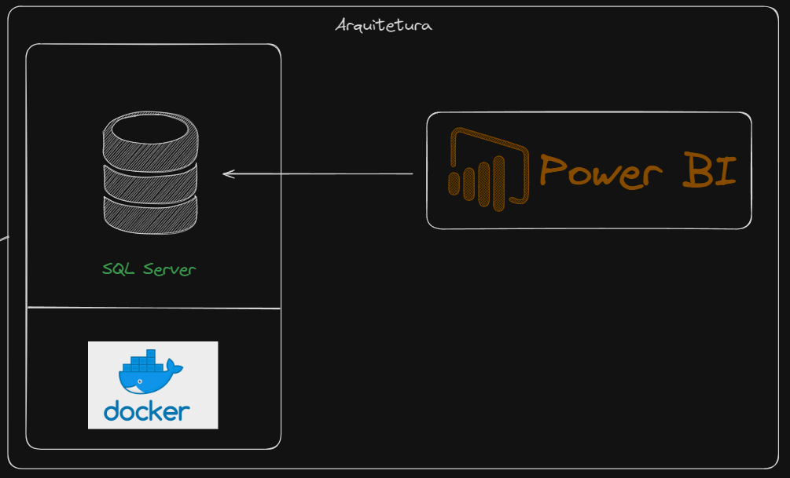
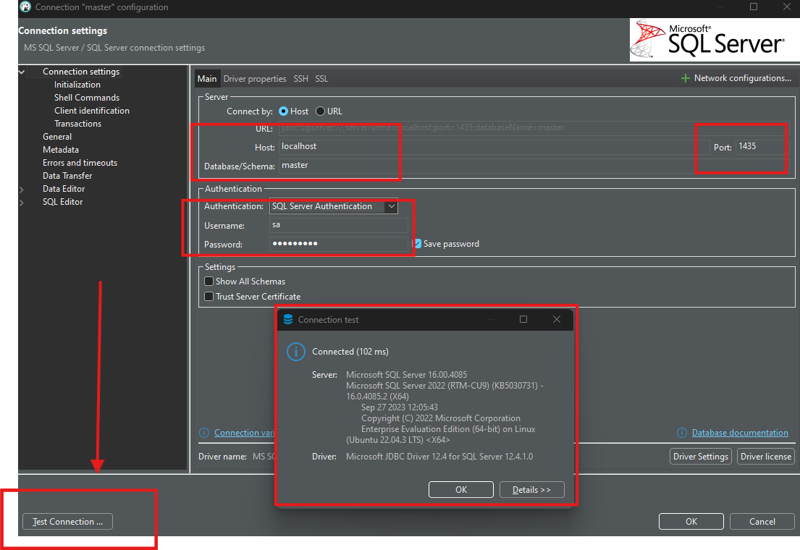
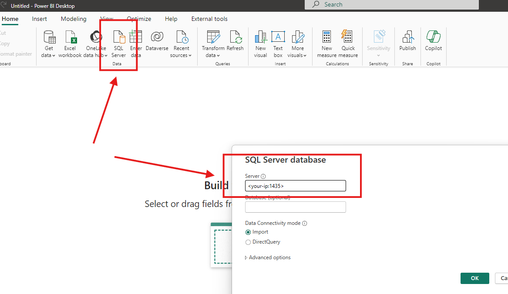
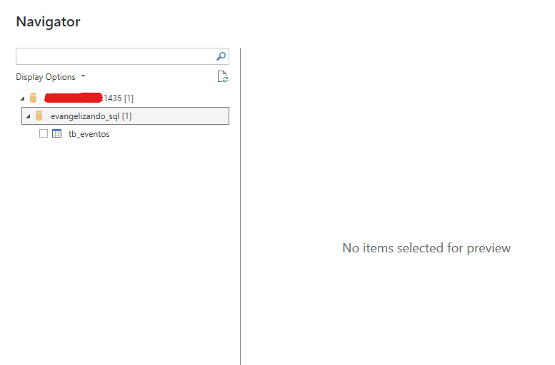

# Evangelizando SQL - SQL Server no Docker
O Evangelizando SQL é um evento com o objetivo de compartilhar conhecimento gratuito sobre a linguagem SQL. 

Nessa apresentação vamos abordar o uso de um banco de dados SQL Server em container Docker.

Vale ressaltar que tudo for utilizar em produção ou comercializar é de sua responsabilidade.

## Link dessa apresentação: 
https://youtube.com/live/97mi44KE070

## Arquitetura


## Pré-requisitos
* Docker

## Como instalar o Docker?
https://www.youtube.com/playlist?list=PLbPvnlmz6e_L_3Zw_fGtMcMY0eAOZnN-H

## Como instalar o SQL Server no Docker?
Step 1: Clone o repositório
```
git clone https://github.com/wlcamargo/evangelizando-sql-docker
```

Step 2: Entre na pasta do projeto
```
cd evangelizando-sql-docker
```

Step 3: Execute o comando para baixar as imagens e rodar os containers
```
sudo docker compose up -d
```

## Como acessar o banco de dados via Dbeaver?
host: your-ip

port: 1435

username: sa

password: mudar@123

Sample connect Dbeaver:


## Como conectar o Power BI no container?
Step 1:


Step 2:


## Referências
https://docs.docker.com/


## Links recomendados
Link dessa apresentação: 
https://youtube.com/live/97mi44KE070

Repositório Evangelizando SQL: 
https://github.com/wlcamargo/evangelizando_sql

Playlist:
https://www.youtube.com/playlist?list=PLbPvnlmz6e_LeQn0tls5MczWIZCj9zZNi


## Equipe do projeto

----------------
Shalom André - https://www.linkedin.com/in/shalomandre/

Canal: https://www.youtube.com/@shalomandre7615

----------------
Wallace Camargo - https://www.linkedin.com/in/wallace-camargo-35b615171/

Canal: https://www.youtube.com/channel/UCK0B4IoF57JoiVVVeEcN8-A

----------------

Ítalo Mesquita - https://www.linkedin.com/in/italomesquita/

Canal: https://www.youtube.com/c/%C3%8DtaloMesquita

----------------

Luiz Lima - https://www.linkedin.com/in/luizvitorlima/

Site: https://luizlima.net/

Canal: https://www.youtube.com/@LuizLima-vz4jb/

----------------

Raphael Amorim - https://www.linkedin.com/in/raphael-amorim-de-santana/

Canal: https://www.youtube.com/@bifastsolutions

----------------

Gabriel Quintella: https://www.linkedin.com/in/gabriel-quintellao

Twitter: https://www.twitter.com/dbaassists

Instagram: https://instagram.com/dbaassists

Site DBA Assists: https://dbaassists.com.br

Linklist: https://linklist.bio/quintellaonaarea

----------------

Reginaldo Batista - https://lnkd.in/dq2pb7Yj 